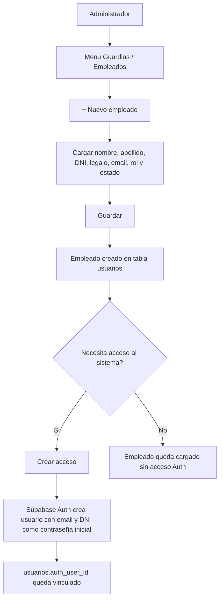
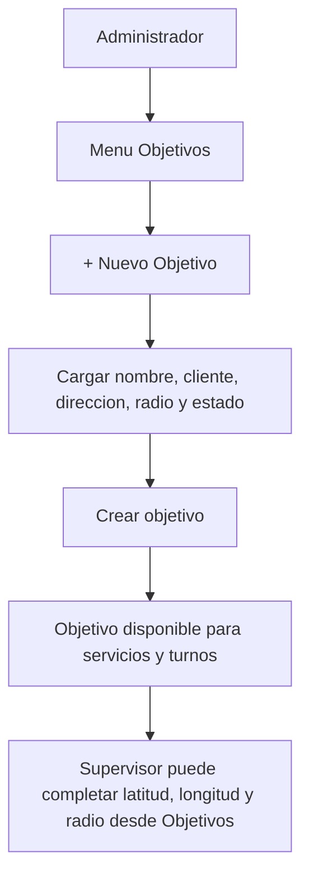
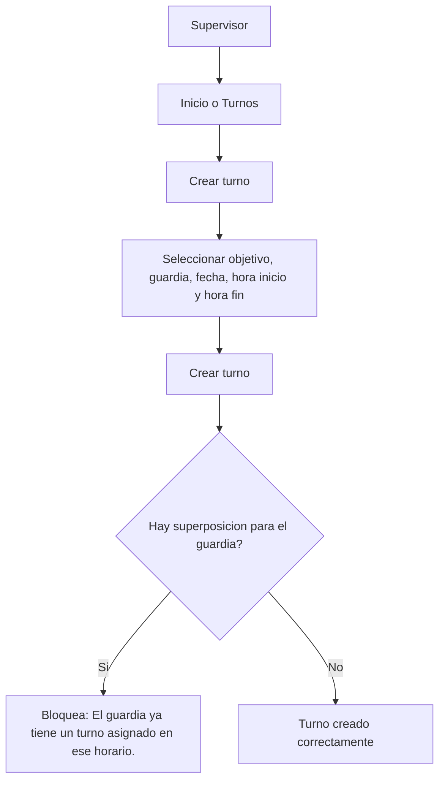
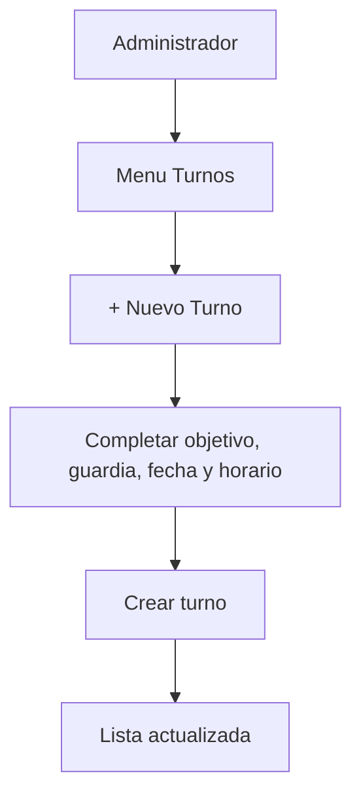
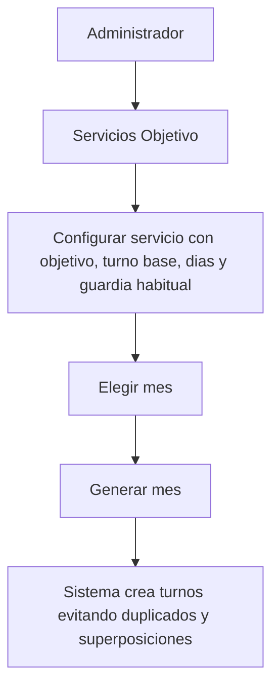
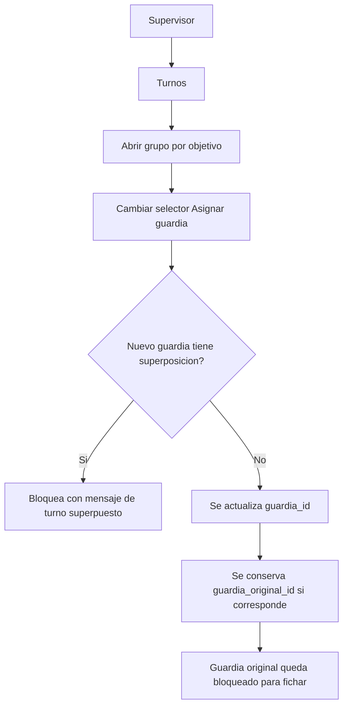
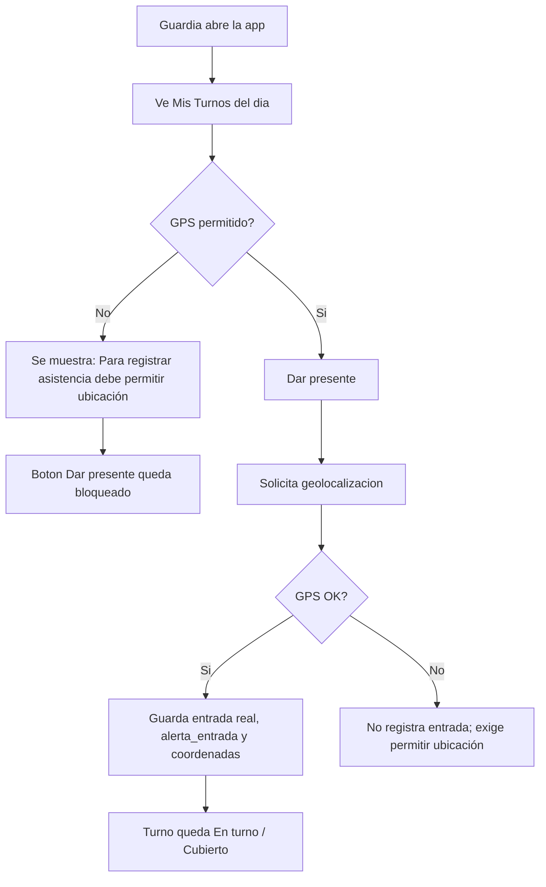
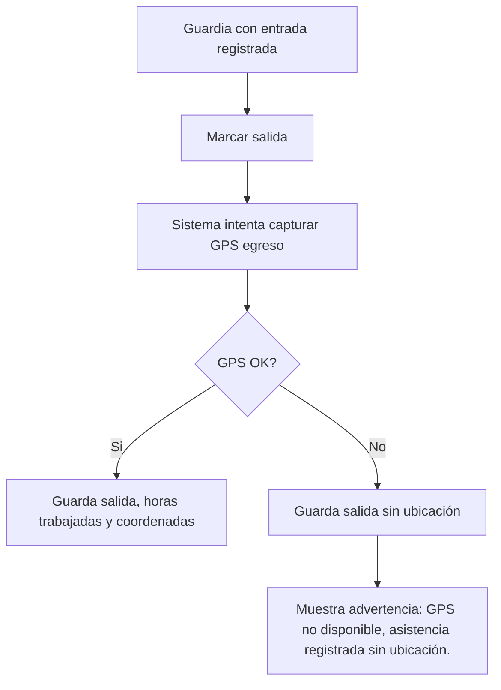
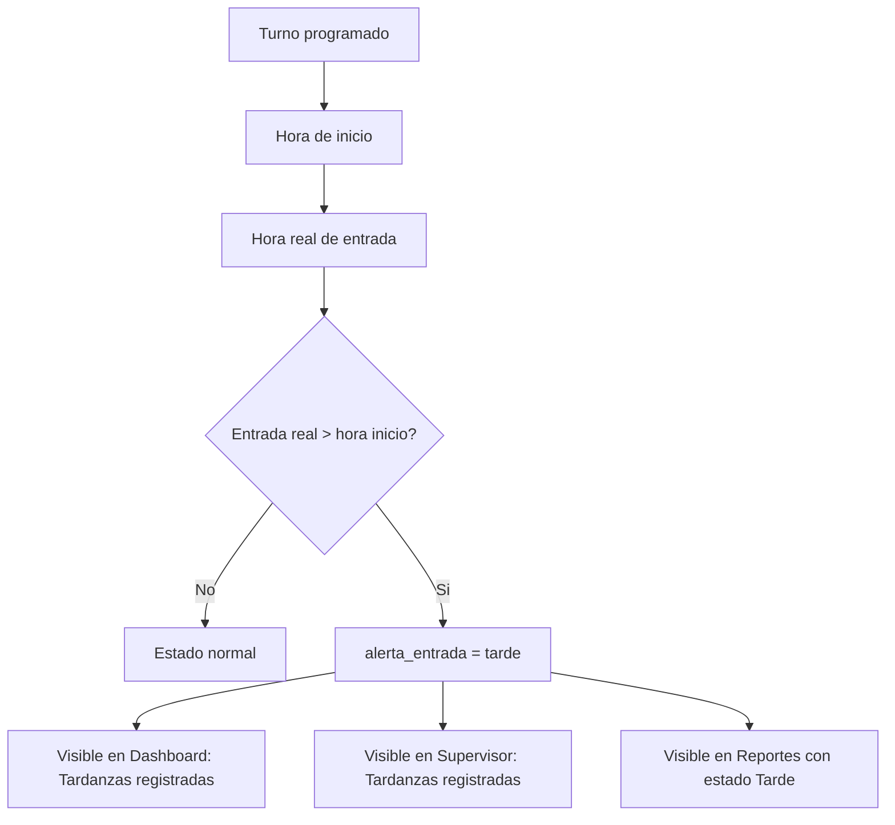
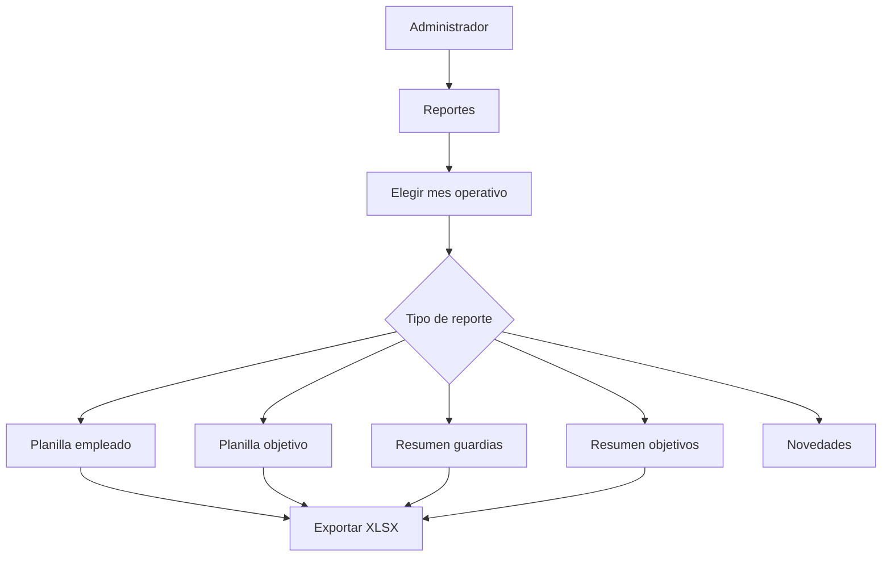

# Manual General De Procesos - Mercosur Seguridad

Este manual explica los procesos operativos completos del sistema actual. Los flujos reflejan las pantallas y botones implementados.

## 1. Alta De Empleado

Acciones reales:

- `+ Nuevo empleado`: abre el formulario.
- `Guardar`: crea o actualiza el empleado.
- `Crear acceso`: crea el usuario Auth si `Acceso` esta en `No`.
- `Reset DNI`: resetea la contraseña al DNI para empleados con acceso.

Validaciones:

- Nombre, apellido y legajo son obligatorios.
- Para crear acceso Auth se requiere email y DNI valido.
- No se muestran contraseñas.
- La grilla muestra `Acceso: Si/No`, no muestra UUID tecnico.

## 2. Creacion De Objetivo

Acciones reales:

- `+ Nuevo Objetivo`: abre alta de objetivo.
- `Editar`: modifica datos del objetivo.
- Boton de activar/inactivar: cambia estado.
- En supervisor: `Editar` permite cargar direccion, latitud, longitud, radio y estado.
- En supervisor: `Actualizar ubicación` intenta tomar la ubicacion actual del dispositivo.

Restricciones:

- El nombre del objetivo es obligatorio.
- Latitud y longitud se validan como numeros en la pantalla supervisor.

## 3. Generacion De Turnos

### Creacion manual por supervisor

### Creacion manual por administrador

### Generacion mensual desde servicios

Reglas actuales:

- Los filtros de turnos son `Hoy`, `Mañana`, `Próximos 7 días` y `Mes actual`.
- Los turnos nocturnos se muestran como horario simple, por ejemplo `18:00 - 06:00`.
- La fecha operativa del turno es `turnos.fecha`, es decir, el dia de inicio.
- Se valida superposicion para el mismo guardia, incluyendo turnos que cruzan medianoche.

## 4. Reasignacion

Mensaje al guardia original:

`Su turno fue reasignado por supervision.`

Impacto:

- El nuevo guardia mantiene el turno.
- Si el nuevo guardia ficha tarde, la tardanza queda asociada al nuevo guardia.

## 5. Fichaje De Entrada

Reglas actuales:

- El guardia puede fichar desde 30 minutos antes del inicio hasta que termina el turno.
- Si intenta fichar antes de esa ventana: `Fuera de horario de fichaje. Contacte al supervisor.`
- Si intenta fichar despues del fin del turno: `El turno ya finalizo. Contacte al supervisor.`
- Si el turno fue reasignado: `Su turno fue reasignado por supervision.`
- El ingreso exige GPS. Si el permiso esta denegado o el navegador no soporta geolocalizacion, no permite fichar.
- Al fichar tarde, se guarda `alerta_entrada = tarde`.

## 6. Fichaje De Salida

Reglas actuales:

- Si ya existe entrada, el guardia puede marcar salida.
- La salida no se bloquea si falla GPS.
- Las horas reales se guardan en `registros_asistencia.horas_trabajadas`.

## 7. Control De Tardanzas

Ejemplo:

- Turno 08:00 a 12:00.
- Entrada real 10:13.
- Minutos tarde aproximados: 133.
- Debe aparecer como `Tarde`, no como `Sin ingreso`.

## 8. Alertas

### Guardias sin fichar

Condicion:

- Turno del dia.
- Guardia asignado.
- El turno no esta descubierto.
- Pasaron 15 minutos desde `hora_inicio`.
- No existe entrada registrada.

Pantallas:

- Dashboard gerencial: bloque `Guardias sin fichar`.
- SupervisorMobile: bloque `Guardias sin fichar`.

### Tardanzas registradas

Condicion:

- Existe asistencia.
- Existe entrada real.
- `alerta_entrada = tarde` o entrada real posterior al inicio.

Pantallas:

- Dashboard gerencial: bloque `Tardanzas registradas`.
- SupervisorMobile: bloque `Tardanzas registradas`.
- Reportes: estado `Tarde`.

### Cobertura / descubiertos

Condicion:

- `guardia_id` es nulo, o
- `estado = descubierto`, o
- paso la ventana operativa de fichaje definida en utilidades y no hay asistencia.

Pantallas:

- Dashboard gerencial: `Turnos descubiertos`.
- SupervisorMobile: `Puestos sin cobertura`.
- Revisión Operativa: alertas de asistencia.

## 9. Reportes

Reglas actuales:

- El mes se calcula por `turnos.fecha`, no por `created_at`.
- Los turnos nocturnos cuentan para el mes del dia de inicio.
- `Horas reales` vienen de `registros_asistencia.horas_trabajadas`.
- `Horas liquidables` se calculan aparte, sin modificar datos historicos.
- No se usan horas programadas como horas reales.

## 10. Exportacion XLSX

Los reportes operativos descargan archivos `.xlsx`.

Exportaciones actuales:

- Planilla individual por empleado: `empleado_[apellido_nombre]_[mes_anio].xlsx`.
- Planilla mensual por objetivo: `objetivo_[nombre_objetivo]_[mes_anio].xlsx`.
- Resumen guardias: `resumen_guardias_[mes].xlsx`.
- Resumen objetivos: `resumen_objetivos_[mes].xlsx`.

Formato implementado:

- Titulo superior.
- Mes seleccionado.
- Filtros principales.
- Encabezados en negrita.
- Autofiltro.
- Fila de encabezado congelada.
- Columnas con ancho automatico.
- Horas con dos decimales.
- Fila de totales al final.
